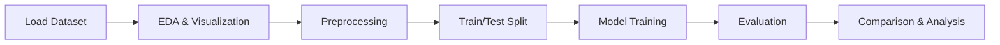

# Proneme Classification
A comprehensive data mining project for classifying audio signals as **nasal sounds** or **oral vowels** using various machine learning algorithms.

[](https://www.python.org/)
[](https://scikit-learn.org/)
[](LICENSE)

---
This project applies data mining techniques to the [Phoneme dataset](https://openml.org/search?type=data&id=1489) from OpenML, aiming to accurately classify sounds into two categories:
- **Class 0**: Nasal sounds
- **Class 1**: Oral vowels

## Objectives

- Perform exploratory data analysis on audio signal features
- Handle class imbalance and preprocess data effectively
- Compare multiple classification algorithms
- Evaluate the impact of dimensionality reduction on model performance

## Methods & Algorithms

### Classification Models
| Algorithm | Description |
|-----------|-------------|
| Decision Tree | Interpretable tree-based classifier |
| Naive Bayes | Probabilistic classifier based on Bayes' theorem |
| K-Nearest Neighbors | Instance-based learning algorithm |
| Multi-Layer Perceptron | Neural network classifier |
| Random Forest | Ensemble of decision trees |
| AdaBoost | Adaptive boosting ensemble method |
| XGBoost | Extreme gradient boosting |

### Dimensionality Reduction
- Feature Selection / Extraction techniques
- 2D projection for visualization and comparison


## Getting Started

### Prerequisites

```bash
pip install -r requirements.txt
```

### Required Libraries

```python
pandas
numpy
scikit-learn
matplotlib
seaborn
xgboost
```


## Workflow



### 1) Data Analysis
- Dataset overview and statistics
- Class distribution analysis
- Feature visualization (2D plots, parallel coordinates)

### 2) Preprocessing
- Missing value detection
- Outlier handling
- Feature normalization/standardization
- Train-test split

### 3) Classification
- Model training with hyperparameter tuning
- Cross-validation
- Performance optimization

### 4) Evaluation
- Accuracy, Precision, Recall, F1-Score
- Confusion matrices
- Comparative bar charts

## 5) Results

Performance comparison across all models with and without dimensionality reduction, analyzing:
- Best performing classifiers
- Impact of feature reduction
- Algorithm sensitivity to dimensionality
---

<p align="center">
  <i>University Project - Data Mining 2.1: Classification</i>
</p>
